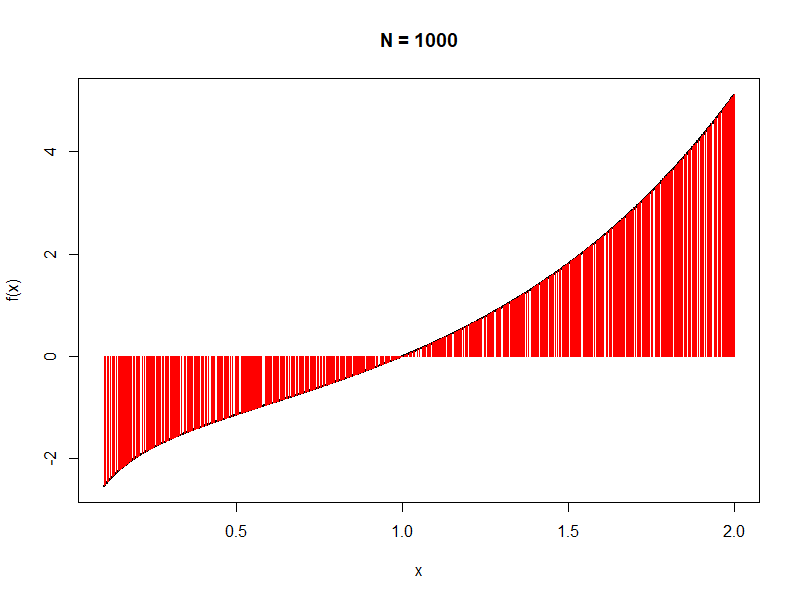
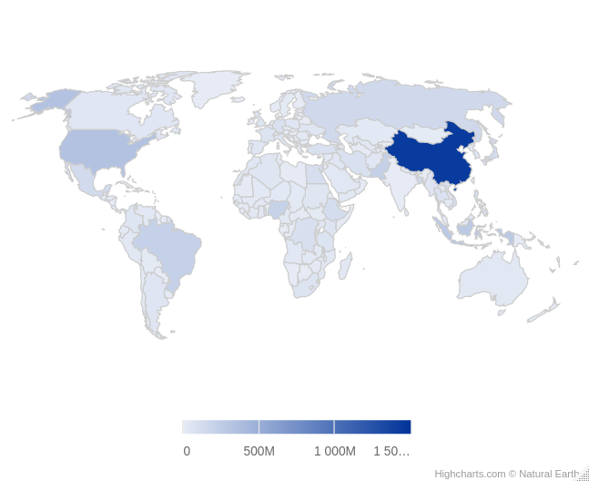
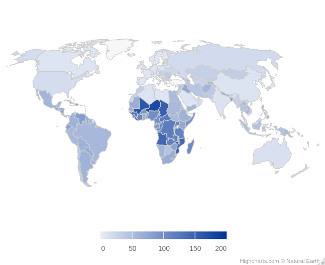
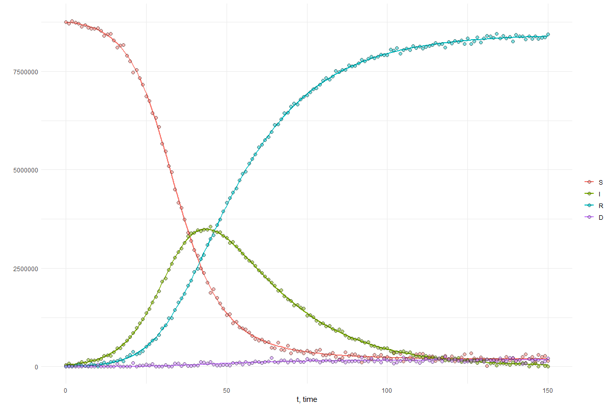

# Homework 3

## Objectives :full_moon_with_face: 
The objectives of this homework assignment are the followings:

- Become competent at programming effectively using `if`/`else` and iterations statements; 
- Learn how to program effectively using functions and think like a programmer;  
- Improve your collaborative skills via GitHub.

## Deadline :alarm_clock:

Submit the homework at last by Monday 14th of November 2022 at 23:59pm 
by pushing to the dedicated repository.

## Requirements :warning:

This homework **must** be accomplished using the appropriate GitHub template and respect the following requirements:

- All members of the group must commit at least once.
- All commit messages must be reasonably clear and meaningful.
- Your GitHub repository must include at least the following:
  + One issue containing some form of __TO DO__ list.
  + One pull request followed by a merging.
- Organization (separation of work,...) and progress for your group must appear clearly in __GitHub Projects__.

You can create one or several RMarkdown files to answer the following problems:


## Content :rocket: 


### 1. Easy variance II

#### Problem statement

The bootstrap is a straightforward method for estimating quantities for a statistic such as an estimator of its variance. 

#### Exercise

1.  Using your most efficient implementation of the bootstrap from the previous homework, write a function named `bootstrap` with arguments `x` for a vector of sample data, `B` for the number of bootstrapped samples with default values `1000L` and `statistic` for a generic function to be passed. The function must return a list with the statistic evaluated on the sample `x`, say `theta_hat`, on the bootstrapped samples, say `theta_star`, and an estimate of the variance of the statistic, say `varBoot`. 

2.  Simulate a sample of size $10^4$ from a $t$-distribution with $\nu=3$ degrees of freedom (when $\nu\to\infty$, then the $t$-distribution tends to a standard normal distribution). Using the base R variance `var` as the `statistic`, compute the $B=1,000$ bootstrapped statistics using your function for subsamples of size $100$, $1,000$ and the full sample that you generated, and make three boxplots in one graph. The true variance is given by $\nu/(\nu-2)$. Illustrate it in your graph and comment what has been obtained. Does it illustrate some concepts in statistics or probability theory?

3.  Take the one of the subsample of 2., and compare the performances between your implementation of `bootstrap` with the function bootstrap from the bootstrap package (installation required). Make sure the comparison is as fair as possible (same number of bootstrap samples, ...).

4.  Load `test1.rds` and make this call `bootstrap(a, statistic = mean)`. The call must returns the following error:
```{r}
Error in bootstrap(a, statistic = mean) : 'x' must be numeric
```
Adapt your implementation until this error message shows.

5. Load `test2.rds` and execute `bootstrap(M, statistic = mean)`. The call must returns the following warning:
```{r}
Warning message:
In bootstrap(M, statistic = mean) : 'x' has been coerced to a vector
```
it means that `M` is treated as a vector (dim is NULL). Modify your implementation in order to coerce `M` to a vector and show the above warning once the coercion happens.

6. Modify your implementation of `bootstrap` so `bootstrap(M, B="a", statistic = mean)` shows the following error
```{r}
Error in bootstrap(M, B = "a", statistic = mean) : 'B' must be numeric
```

7. Modify your implementation of `bootstrap` so `bootstrap(M, statistic = "mean")` shows the following error
```{r}
Error in bootstrap(M, statistic = "mean"") : 'statistic' must be a function
```

8. Load `test3.rds` and see what happens when executing `bootstrap(m, statistic = mean)`. Remove any missing value from `m` and re-run the function calls. Removing missing values should happen within the function calls. The function `mean` has an argument for removing missing values, namely `mean(m, na.rm=TRUE)`. You are to exploit that, but `bootstrap(m, statistic = mean(na.rm = TRUE))` does not work (try it).  Modify your implementation by using `...` as an argument in order for `bootstrap(m, statistic = mean, na.rm = TRUE)` to return the expected results.


### 2. Monte-Carlo integration

#### Problem statement

In this problem, we consider a Monte-Carlo approach for approximating the integral of a function $f(x) = e^x \ln(x)$ (that you assume you do not know) on the interval $x \in [0.1, 2]$:

$$I = \int_{0.1}^2 e^x \ln(x) \mathrm{d}x.$$

We consider the following method for estimating this integral:

1. Simulate $N$ random variables $U_i$ that are uniform on the segment $[0.1, 2]$, $i=1,\dots,N$, i.e. $U_i \sim \mathrm{Unif}(0.1, 2)$.
2. Evaluate function $f(x)$ at each of these points, i.e. calculate $f_i = f(U_i)$.
3. Estimate the integral $I$ as follows:

$$I = 1.9 \cdot \mathbb{E}[f(U)] = 1.9 \cdot \frac{1}{N} \sum_{i = 1}^N f_i. $$

*If you want to understand why this method works, see the bottom of the page.*

**a)** Create a function that approximates $I$ following the above recipe. Your function should be called `find_integral()` and should have five arguments:
  
  + `f`: the function to be integrated;
  + `xlim`: the integration limits in a form of array with two elements;
  + `N`: the number of points for the approximation with default value `N = 10000`;
  + `seed`: a positive integer that controls the generation of random numbers with default value `seed = 10`;   
  + `make_plot`: a Boolean value that controls whether or not a graph should be made (see below for details and use `make_plot = FALSE` as default).
  
Your functions should look like:

```{r}
f <- function(x) {
  return(exp(x) * log(x))
}

find_integral <- function(f, xlim, N = 10000, seed = 10, make_plot = FALSE){
  if (missingArg(f)) {
    f <- function(x) {exp(x) * log(x)}
  }
  if (missingArg(xlim)) {
    xlim <- c(0.1, 2)
  } else if (!is.numeric(xlim) || length(xlim) != 2) {
    stop('xlim is not properly defined')
  }
  # Control seed
  set.seed(seed)
  
  # Simulate N points
  U = ...
  
 ...
 
 return(integral_app)
}
```

When enabling the plot by setting `make_plot = TRUE`, the function `find_integral()` should produce the plot of the function `f`, and `N` vertical lines -- each line $i$ should should have the X-coordinate of $U_i$ and the Y-coordinate of $f_i$. See below for an example.



**b)** Run the function `find_integral()` for different sample sizes, i.e. let $N = 10, 100, 1000, \ldots, 10^7$. Verify that the higher $N$ gets, the closer the approximation of $I$ is to the true value, which is equal to $\sim 1.08940631317341$.


#### Correctness of the problem

Since random variables $U_i$ are independent and uniformly distributed, their density function is $f_{U}(x) = 1.9^{-1} \cdot \mathbb{1}(x \in [0.1, 2])$, where $\mathbb{1}$ is the indicator function. Therefore, the expected value of a function of of the random variable is

$$\mathbb{E}[f(U)] = \int_{-\infty}^\infty f(x) \cdot f_U(x) \mathrm{d}x = \frac{1}{1.9} \int_{0.1}^2 e^x \ln(x) \mathrm{d}x = \frac{1}{1.9} \cdot I.$$

Finally, the integral $I$ can be expressed as

$$I = 1.9 \cdot \mathbb{E}[f(U)] = 1.9 \cdot \frac{1}{N} \sum_{i = 1}^N f_i,$$

where the last step is the Monte-Carlo approximation of the expected value $\mathbb{E}$.


### 3. World map

#### Problem statement

Very often, it is of interest to fetch data from a web platform for variety of tasks. The procedure generally involves some data manipulation. For this problem, you will be asked to fetch some data about countries in the world from Internet through webscraping, to clean and manipulate the targetted data to finally to make a plot under the form of a world map.

To complete this exercise, you will need the following packages: `rvest`, `highcharter`, `tibble`, `countrycode` and `RSelenium`.

#### World population

For the first part of the problem, the goal is to fetch data on the world population and to plot it on the world map.

1. Using the webscraping seen in class, fetch the table from <https://www.worldometers.info/world-population/population-by-country/> and save it as an object.
2. Now you need to perform some data manipulations. First, you will need countries in ISO-3 character format. You can use the function `countrycode::countrycode(x, origin = 'country.name', destination = 'iso3c')` where `x` represents the countries from the webscrapped data table. Potential missing values can be ignored. Then, you will need to change the format of the population data you fetched. You obtain strings of the form `"9,904,607"` and need to convert it into numerical values. What happens if you type `as.numeric("9,904,607")` into your R console? `R` does not understand the `,`. We propose that you simply delete the `,`, for that, you need to use some _regex_ which stands for regular expression. Here, you can simply use the code `gsub("\\,", "", x)` where `x` is the vector of population (try `gsub("\\,", "", "9,904,607")`). Finally, you should create a `tibble` with one column called `ISO` and a column with the population, say `value`.
3. Finally, you can create a world map using
```
hcmap(
  "custom/world-robinson-lowres",
  data = data,
  name = "Population",
  value = "value",
  joinBy = c("iso-a3", "ISO")
) 
```
from the `highcharter` package, where data is the `tibble` you created on 2. The output should look like this:



4. Repeat steps 1. to 3. with Total cases of Covid by country that you can find here <https://www.worldometers.info/coronavirus/#countries>.

#### World bank data

For the second part of the problem, you are asked to webscrap data from the World Bank to plot it in the world map. This brings a new challenge, the data cannot be webscrapped directly as it is dynamically pulled from databases. The solution to this problem brings a new tool, `RSelenium` for webscraping. 

After installing the package, you will use `RSelenium` to open a web-browser towards which commands can be passed from `R`. Here, we propose to use Firefox, but you can choose a different one, as long as it works. Before webscrapping, do the following:
```
rD <- rsDriver(browser="firefox", port=4545L, verbose=F)
remDr <- rD[["client"]]
url <- "https://data.worldbank.org/indicator/SP.ADO.TFRT"
remDr$navigate(url)
html_page <- remDr$getPageSource()[[1]]
```
The first line should open Firefox. The fourth line should fetch the desired url into Firefox and the last line save the HTML page into a `html_page` object. Here we are interested in the Adolescent fertility rate (births per 1,000 women ages 15-19).

1. Using the webscraping seen in class, fetch the data from the `html_page` object. Note that there is no table per se, so you will need to fetch text. Your code should look like `raw_data <- read_html(html_page) %>% html_nodes(...) %>% html_text()`. I advise that you inspect the HTML, look at the class of the data you want to fetch and use `.class` in place of the `...` where `class` should be replaced by the appropriate class you find during inspection. The `raw_data` object should look like
```
[1] "CountryMost Recent YearMost Recent Value"                
[2] "Afghanistan202058"                                       
[3] "Albania202019"                                           
[4] "Algeria20209"  
```
2. Data manipulation here is more involved. You should on one part extract countries names and on the other part the values that appear after `2020`. First, countries. This can be achieved by deleting the digit parts of the characters. You can use the following code `country <- gsub("[[:digit:]]*", "", raw_data)`. The cheat sheet [here](https://hypebright.nl/index.php/en/2020/05/25/ultimate-cheatsheet-for-regex-in-r-2/) is particularly useful when working with `regexp`. Second, the data. It can be obtained by substituting spaces and special characters by a character, then deleting all characters followed by 4 digits (like 2020). The following can achieve this
```
raw_data2 <- gsub("\\s","a",raw_data)
raw_data2 <- gsub("\\W","a",raw_data2)
data <- gsub("[[:alpha:]]*\\d{4}", "", raw_data2)
```
Line 1 and 2 substitute spaces and special characters by the letter "a". The last line deletes any number of characters followed by four digits. The remaining is the seek data. Create a tibble with the ISO and the data.

3. Create a world map similarly to the first part of the problem. You should obtain something like this:



4. Repeat 1. to 3. with the GDP by country in current $.


### 4. Devastating epidemic

#### Problem statement

Assume that Switzerland is affected by a nasty and deadly disease.
Luckly, you survived and now you've got the data of the epidemic evolution over the period of 150 days. The data contains information on the number of subsceptible to the disease individuals $S(t)$ at time $t$, number of infected individuals $I(t)$, number of recovered individuals $R(t)$, and number of deceased individuals $D(t)$.

In order to investigate the disease, you use $SIRD$ epidemiological model

$$
\begin{equation}
\begin{aligned}
\frac{dS}{dt} &= -\beta \cdot \frac{S I}{N},\\
\frac{dI}{dt} &= \beta \cdot \frac{S I}{N} - \gamma I - \mu I,\\
\frac{dR}{dt} &= \gamma I,\\
\frac{dD}{dt} &= \mu I
\end{aligned}
\end{equation}
$$

to estimate its characteristics:

+ $\beta$ - infection rate;
+ $\gamma$ - recovery rate;
+ $\mu$ - mortality rate.

Here, $N$ is the population number, which is assumed to remain constant.
Also, we denote a vector $Z(t) = \left(S(t), I(t), R(t), D(t)\right)$ as the state of the population at time $t$. Note, that `sum(Z) == N`.


#### Exercise

To estimate the parameters of $SIRD$ model, follow the steps:

1. Load the data `sird_data.csv`. Separate the table into `times` when the observations are recoded and the states of the population `Z_data`.
2. Initialize your "wild guess" of the parameters that you think are true:

```{r}
params_0 <- c(
  beta = ...,
  gamma = ...,
  mu = ...
)
```

3. Using the data, initialize $Z_0 \equiv Z(0)$, the state of the population at the beginning of the epidemic, and `times` at which the observations are recorded: $0, 1, 2, \ldots, 150$ days.
4. Define a function `sird_model()`, which returns derivatives over time of each population group:

```{r}
sird_model <- function(time, Z, par) {
  beta = par[1]
  gamma = par[2]
  mu = par[3]
  
  S = Z[1]
  I = Z[2]
  R = Z[3]
  D = Z[4]
  N = sum(Z)
  
  dS = -beta*S/N*I
  dI = beta*S/N*I - gamma*I - mu*I
  dR = gamma*I
  dD = mu*I
  
  return(list(c(dS, dI, dR, dD)))
}
```

5. Now, use `ode(Z_0, times, sird_model, params_0)` from `deSolve` package to get the population dynamics over time with your "wild guess"ed parameters. This function integrates the system of _Ordinary Differential Equation_ and returns the solution $Z(t)$. Compare the obtained solution with the given data.

6. It is time to find the best parameters that characterize the disease. Define the loss function as the sum of squared errors across all population groups:

$$\mathrm{Loss}(\beta, \gamma, \mu) = \sum_{t = 0}^{150}\left[(S_{fit}(t) - S_{data}(t))^2 + (I_{fit}(t) - I_{data}(t))^2 + (R_{fit}(t) - R_{data}(t))^2 + (D_{fit}(t) - D_{data}(t))^2\right],$$

where `Z_fit` is calculated at `times` with `ode()` using the parameters $\beta, \gamma, \mu$ and the initial state `Z_0`.

7. Minimize the loss function with respect to parameters $\beta, \gamma, \mu$ using `optim()` function from `stats` package. Use `method = "L-BFGS-B"` and restrict parameters to be positive, i.e. specify `lower = ...`. Report the optimal parameters.

8. Finally, use the optimal parameters to calculate the population states `Z_fit` at `times`, i.e. run `ode(Z_0, times, sird_model, params_opt)`, and plot the results. You should provide a graph of the fitted values `Z_fit` and the observed data `Z_data`.


